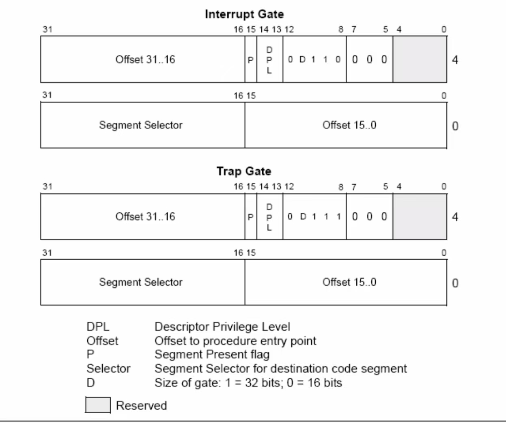

## 1.为什么开始启动计算机的时候，执行的是BIOS代码而不是操作系统自身的代码？
因为CPU不知道操作系统代码的位置，并且操作系统的代码没有加载到主存。而BIOS程序的代码被固化在电脑的一块ROM内存上，通过硬件电路，CPU可以直接读取。

## 2.为什么BIOS只加载了一个扇区，后续扇区却是由bootsect代码加载？为什么BIOS没有直接把所有需要加载的扇区都加载？
因为BIOS只负责加载引导扇区，而引导扇区的代码负责加载操作系统盘。

## 3.为什么BIOS把bootsect加载到0x07c00，而不是0x00000？加载后又马上挪到0x90000处，是何道理？为什么不一次加载到位？
0x00000~0x10000是BIOS程序，中断向量表与一些系统信息存放的地方。加载后挪到0x90000是为了给系统盘腾出位置。加载到0x07c00是硬件规定的。

## 4.bootsect、setup、head程序之间是怎么衔接的？给出代码证据。
bootsect -> setup: 直接跳转到setup.s代码位置执行
```assembly
    SETUPSEG = 0x9020
    jmpi	0,SETUPSEG
```
setup -> head: 跳转到cs段，即为head.s代码位置
```assembly
    jmpi	0,8	
```

## 5.setup程序的最后是jmpi 0,8 ，为什么这个8不能简单的当作阿拉伯数字8看待，究竟有什么内涵？
8的二进制位为1000， 第一位表示第一个段即为代码段，第二位0表示GDT，最后两位表示特权级即为0特权级

## 6.保护模式在“保护”什么？它的“保护”体现在哪里？特权级的目的和意义是什么？分页有“保护”作用吗？
保护不同进程的内存空间，体现在特权级。特权级为了实现不同特权级跳转之间的保护，页面具有保护位与读写位，有保护作用。

## 7.在setup程序里曾经设置过gdt，为什么在head程序中将其废弃，又重新设置了一个？为什么设置两次，而不是一次搞好？
一次是实模式下的，一次是保护模式下的，这两个模式最大寻址范围不同，所以设置的段限长也不同。


## 8.进程0的task_struct在哪？具体内容是什么？
在task[0]出，被初始化为 ``INIT_TASK``：
```c
#define INIT_TASK \
/* state etc */	{ 0,15,15, \
/* signals */	0,{{},},0, \
/* ec,brk... */	0,0,0,0,0,0, \
/* pid etc.. */	0,-1,0,0,0, \
/* uid etc */	0,0,0,0,0,0, \
/* alarm */	0,0,0,0,0,0, \
/* math */	0, \
/* fs info */	-1,0022,NULL,NULL,NULL,0, \
/* filp */	{NULL,}, \
	{ \
		{0,0}, \
/* ldt  */	{0x9f,0xc0fa00}, \
		{0x9f,0xc0f200}, \
	}, \
/*tss*/	{0,PAGE_SIZE+(long)&init_task,0x10,0,0,0,0,(long)&pg_dir,\
	 0,0,0,0,0,0,0,0, \
	 0,0,0x17,0x17,0x17,0x17,0x17,0x17, \
	 _LDT(0),0x80000000, \
		{} \
	}, \
}
```

## 9.内核的线性地址空间是如何分页的？画出从0x000000开始的7个页（包括页目录表、页表所在页）的挂接关系图，就是页目录表的前四个页目录项、第一个个页表的前7个页表项指向什么位置？给出代码证据。
页目录记录四个页表的地址，四个页表与1MB到16MB的页面一一对应
```c
	movl $pg0+7,_pg_dir		/* 7 is 111b -> set present bit/user r/w */
	movl $pg1+7,_pg_dir+4		/*  --------- " " --------- */
	movl $pg2+7,_pg_dir+8		/*  --------- " " --------- */
	movl $pg3+7,_pg_dir+12		/*  --------- " " --------- */
	movl $pg3+4092,%edi		/* last entry in pg_dir */
	movl $0xfff007,%eax		/*  16Mb - 4096 + 7 (r/w user,p) */
	std
1:	stosl			/* fill pages backwards - more efficient :-) */
	subl $0x1000,%eax		/* this let pg_3 point to the last 1K page */
	jge 1b			/* copy to all the pg_3 */
```


## 10.在head程序执行结束的时候，在idt的前面有184个字节的head程序的剩余代码，剩余了什么？为什么要剩余？
为了对齐，剩余了一些head代码。

## 11.为什么不用call，而是用ret“调用”main函数？画出调用路线图，给出代码证据。
因为想要main跳转到一个指定的地方，如代码中的死循环，而不是下一句代码。
```c
	pushl $0		# These are the parameters to main :-)
	pushl $0
	pushl $0
	pushl $L6		# return address for main, if it decides to.
	pushl $_main
	jmp setup_paging
L6:
	jmp L6	

    ...

    ret
```

## 12.用文字和图说明中断描述符表是如何初始化的，可以举例说明（比如：set_trap_gate(0,&divide_error)），并给出代码证据。
设置中断使用的同一个函数，只是宏定义了不同的参数
```c
#define set_intr_gate(n,addr) \
	_set_gate(&idt[n],14,0,addr)

//// 设置陷阱门函数
#define set_trap_gate(n,addr) \
	_set_gate(&idt[n],15,0,addr)

//// 设置系统调用门函数
#define set_system_gate(n,addr) \
	_set_gate(&idt[n],15,3,addr)
```
其中n是中断号，addr是中断处理程序地址，_set_gate第二个参数是类型，第三个参数是dpl，这些参数用来设置IDT
IDT如图：

设置代码：
```c
#define _set_gate(gate_addr,type,dpl,addr) \
__asm__ ("movw %%dx,%%ax\n\t" \
	"movw %0,%%dx\n\t" \
	"movl %%eax,%1\n\t" \
	"movl %%edx,%2" \
	: \
	: "i" ((short) (0x8000+(dpl<<13)+(type<<8))), \
	"o" (*((char *) (gate_addr))), \
	"o" (*(4+(char *) (gate_addr))), \
	"d" ((char *) (addr)),"a" (0x00080000))
```

## 13.在IA-32中，有大约20多个指令是只能在0特权级下使用，其他的指令，比如cli，并没有这个约定。奇怪的是，在Linux0.11中，3特权级的进程代码并不能使用cli指令，这是为什么？请解释并给出代码证据。
eflags 中的IOPL设置为0，则不能cli

## 14.进程0的task_struct、内核栈在哪？具体内容是什么？给出代码证据。
内核栈在init_task这个联合中
```c
// 任务联合，包括任务结构体和内核堆栈
union task_union {
	struct task_struct task;
	char stack[PAGE_SIZE]; 				// 4KB
};

// 定义初始任务的数据(sched.h 中) 非常重要！！！！
static union task_union init_task = {INIT_TASK,};
```

## 15.在system.h里
```c
#define _set_gate(gate_addr,type,dpl,addr) \
__asm__ ("movw %%dx,%%ax\n\t" \
    "movw %0,%%dx\n\t" \
    "movl %%eax,%1\n\t" \
    "movl %%edx,%2" \
    : \
    : "i" ((short) (0x8000+(dpl<<13)+(type<<8))), \
    "o" (*((char *) (gate_addr))), \
    "o" (*(4+(char *) (gate_addr))), \
    "d" ((char *) (addr)),"a" (0x00080000))

#define set_intr_gate(n,addr) \
    _set_gate(&idt[n],14,0,addr)

#define set_trap_gate(n,addr) \
    _set_gate(&idt[n],15,0,addr)

#define set_system_gate(n,addr) \
    _set_gate(&idt[n],15,3,addr)
```
## 读懂代码。这里中断门、陷阱门、系统调用都是通过_set_gate设置的，用的是同一个嵌入汇编代码，比较明显的差别是dpl一个是3，另外两个是0，这是为什么？说明理由。
系统调用要在用户特权级下运行，而其他两个都是在特权级下才能运行。

## 16.进程0 fork进程1之前，为什么先调用move_to_user_mode()？用的是什么方法？解释其中的道理。
手动模拟一次中断返回，手动设置``long eip,long cs,long eflags,long esp,long ss``的值
```C
#define move_to_user_mode() \
__asm__ ("movl %%esp,%%eax\n\t" \
	"pushl $0x17\n\t" \
	"pushl %%eax\n\t" \
	"pushfl\n\t" \
	"pushl $0x0f\n\t" \
	"pushl $1f\n\t" \
	"iret\n" \
	"1:\tmovl $0x17,%%eax\n\t" \
	"movw %%ax,%%ds\n\t" \
	"movw %%ax,%%es\n\t" \
	"movw %%ax,%%fs\n\t" \
	"movw %%ax,%%gs" \
	:::"ax")
```
此时可知cs 为 0x0f 即为用户代码段，ldt，3特权级，eip为`` 1:\tmovl $0x17,%%eax\n\t" ``处的地址，完成了一次特权级的转换。

## 17.进程0的用户栈在哪？给出代码证据。
在特权级切换的时候，把内核进程的栈指针（ss，esp）完全复制了，与现在的内核代码的栈一样。
```c
// head.s
	lss _stack_start,%esp	

// sched.c
    struct {                             // 堆栈开始结构（地址指针，数据段选择符）
	long * a;
	short b;
	} stack_start = { & user_stack [PAGE_SIZE>>2] , 0x10 };	
```


## 18.static inline _syscall0(int,fork)中，为什么要加inline？去掉会有什么问题？给出详细论证。
为了不污染栈空间，inline函数，在编译的时候会直接把代码插入到调用的地方，从而避免了使用call，ret，在使用call，ret的时候要压入地址。而fork的作用是创建子程序，在切换到子程序的时候，由于copy_process把父进程的eip直接赋值给子进程，并且共用一个堆栈，此时若不使用inline，在调用fork的时候会把下一行地址压入栈，那么无论是子进程先调用返回还是父进程先调用返回，轮换到另一个进程执行的时候，地址都会缺失，导致跳转到位置地方。


## 19.copy_process函数的参数最后五项是：long eip,long cs,long eflags,long esp,long ss。查看栈结构确实有这五个参数，奇怪的是其他参数的压栈代码都能找得到，确找不到这五个参数的压栈代码，反汇编代码中也查不到，请解释原因。
调用fork的时候，
```C
#define _syscall0(type,name) \
type name(void) \
{ \
long __res; \
__asm__ volatile ("int $0x80" \
	: "=a" (__res) \
	: "0" (__NR_##name)); \				 
if (__res >= 0) \
	return (type) __res; \
errno = -__res; \
return -1; \
}
```
其中``int $0x80``会把这几个参数压栈。

## 20.分析get_free_page()函数的代码，叙述在主内存中获取一个空闲页的技术路线。

反向扫描mem_map空闲位置，扫描成功就设置使用并返回地址。
```c
// memory.c
/*
 * Get physical address of first (actually last :-) free page, and mark it
 * used. If no free pages left, return 0.
 */
//// 取空闲页面。如果已经没有内存了，则返回 0。 
 // 输入：%1(ax=0) - 0；%2(LOW_MEM)；%3(cx=PAGING PAGES)；%4(di=mem_map+PAGING_PAGES-1)。 
 // 输出：返回%0(ax=页面号)。 
 // 从内存映像末端开始向前扫描所有页面标志（页面总数为 PAGING_PAGES），如果有页面空闲（对应 
 // 内存映像位为 0）则返回页面地址。
unsigned long get_free_page(void)
{
	// 在mem_map 中反向扫描得到空闲页面，故从16M高地址开始分配页面
    register unsigned long __res asm("ax");

    /*
    scasb: 
        if (AL == *EDI) {
            ZF = 1;  // 设置零标志
        } else {
            ZF = 0;  // 清除零标志
        }
        EDI = EDI ± 1;  // 根据 DF 标志决定增减
    scasb:
        repeat until ECX = 0 or ZF = 1
    init :
    AL : 0
    ecx : PAGING_PAGES
    edx: mem_map+PAGING_PAGES-1
    */

    __asm__("std ; repne ; scasb\n\t"
        "jne 1f\n\t"
        "movb $1,1(%%edi)\n\t"		// edi is free page's last position
        "sall $12,%%ecx\n\t"		// page actually location
        "addl %2,%%ecx\n\t"			// add LOW_MEM
        "movl %%ecx,%%edx\n\t"
        "movl $1024,%%ecx\n\t"
        "leal 4092(%%edx),%%edi\n\t"
        "rep ; stosl\n\t"
        "movl %%edx,%%eax\n"
        "1:"
        :"=a" (__res)
        :"0" (0),"i" (LOW_MEM),"c" (PAGING_PAGES),
        "D" (mem_map+PAGING_PAGES-1)		// sign the memory
        :"di","cx","dx");
    return __res;
}
```